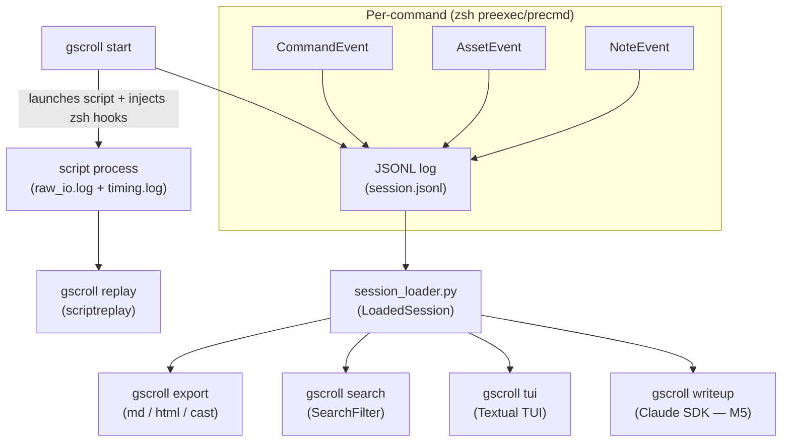
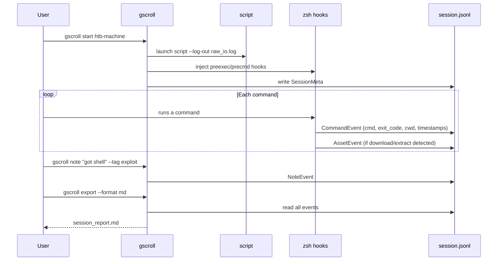
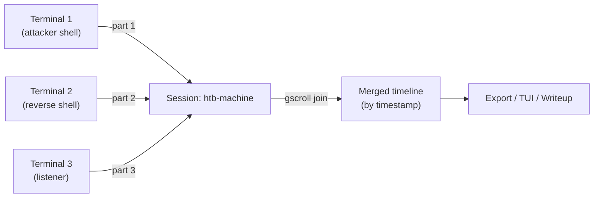

# Guild Scroll

<div align="center">


[](https://buymeacoffee.com/santiagogow)

**Terminal session recorder for CTF competitions and authorized penetration testing.**

Guild Scroll wraps your terminal with `script` and zsh hooks to capture every command, output, and asset into structured JSONL logs — so you can replay, search, export, and report without manual note-taking.

[Installation](#installation) · [Quick Start](#quick-start) · [Codebase Guide](#codebase-guide) · [Roadmap](#roadmap) · [Contributing](#contributing)

</div>

---

## What It Does

You start a session, work normally, and Guild Scroll captures everything in the background. When you're done, you have a structured, searchable record you can export as Markdown, HTML, or an asciicast playback — and eventually feed to an AI to generate a writeup.

```
gscroll start htb-machine    # begin recording
# ... do your work ...
gscroll export --format md   # structured report, ready to share
```

---

## Features

| Category | Capability |
|---|---|
| **Recording** | Raw I/O + timing via `script`; `[REC]` colored prompt indicator |
| **Command logging** | Per-command metadata via zsh hooks: timestamp, exit code, working dir |
| **Asset detection** | Automatic capture of wget, curl, git clone, tar, unzip, and 40+ patterns |
| **Tool tagging** | 40+ security tools auto-classified as `recon` / `exploit` / `post-exploit` |
| **MITRE ATT&CK** | Each tool mapped to a MITRE technique ID |
| **Annotations** | Timestamped notes and tags, mid-session or post-session |
| **Export** | Markdown report, self-contained HTML, live web previews/downloads, asciicast v2 (`.cast`) |
| **Search** | `gscroll search --tool nmap --phase recon --exit-code 0 --output-contains 'open'` |
| **Validation** | `gscroll validate [SESSION] --repair` checks JSONL/assets/parts and patches repairable metadata |
| **Replay** | `gscroll replay` via `scriptreplay` with speed control |
| **TUI** | Interactive Textual dashboard — session sidebar, phase timeline, command table |
| **Web preview** | `gscroll serve` hosts a localhost-only HTML viewer and JSON API |
| **Session auto-detect** | All sub-commands pick up `GUILD_SCROLL_SESSION` automatically |
| **Self-update** | `gscroll update` checks GitHub and reinstalls |

---

## Architecture



---

## Session Data Flow



---

## Multi-Session Flow *(M4)*

For scenarios with multiple concurrent terminals (e.g. attacker shell + reverse shell listener):



---

## Installation

### Recommended: pipx

```bash
pipx install git+https://github.com/Panacota96/Guild-Scroll.git
```

### With TUI support

```bash
pipx install "git+https://github.com/Panacota96/Guild-Scroll.git[tui]"
```

### From source (virtual environment)

```bash
git clone https://github.com/Panacota96/Guild-Scroll.git
cd Guild-Scroll
python3 -m venv .venv
source .venv/bin/activate
pip install -e '.[tui]'
```

> **Note for Kali/managed Python environments:** use `pipx` or a venv — avoid `pip install --break-system-packages`.

---

## Quick Start

```bash
# Start a new session
gscroll start htb-machine

# Add a note (auto-detects active session inside a recording)
gscroll note "found open port 80 — Apache 2.4" --tag recon

# Search commands
gscroll search --phase recon
gscroll search --tool nmap --exit-code 0
gscroll search --output-contains "80/tcp open"
gscroll search --tool nmap --output-contains "open"

# Validate integrity and repair session metadata
gscroll validate htb-machine --repair

# Export
gscroll export --format md
gscroll export --format html -o report.html
gscroll export --format cast          # asciicast (asciinema-compatible)

# Structured CPTS-style writeup reports
gscroll export --format md --writeup                    # Markdown writeup with all sections
gscroll export --format html --writeup -o report.html  # Responsive HTML writeup

# Replay
gscroll replay
gscroll replay --speed 2.0

# Interactive TUI dashboard
gscroll tui htb-machine

# Local web preview
gscroll serve

# List all sessions
gscroll list

# Update to latest
gscroll update
```

---

## How It Works

1. `gscroll start <name>` creates `./guild_scroll/sessions/<name>/` and launches `script` to record raw I/O.
2. Zsh hooks (`preexec`/`precmd`) write a `CommandEvent` for every command — with timestamp, exit code, and working directory.
3. The hook parser scans each command for download/extract patterns and writes `AssetEvent` entries automatically.
4. `gscroll note` appends a `NoteEvent` to the log at any point.
5. `gscroll export` loads all events, auto-tags each command by security phase, and renders the chosen format.

---

## Writeup Workflow

`--writeup` generates a structured, client-facing pentest report aligned with CPTS-style outputs:

```bash
# Markdown writeup — all sections, ready to fill in findings
gscroll export htb-machine --format md --writeup

# Self-contained HTML writeup — responsive layout, desktop and mobile
gscroll export htb-machine --format html --writeup -o report.html
```

Both formats include:

| Section | Content |
|---|---|
| **Executive Summary** | Approach, Scope table, Assessment overview |
| **Assessment Summary** | Command counts and tools-used table |
| **Walkthrough** | Step-by-step narrative (first 15 commands) |
| **Reproducibility Steps** | Full command sequence for customer replay |
| **Rabbit Holes / Dead Ends** | Commands with non-zero exit codes |
| **Findings** | Full command table with phase tags |
| **Remediation** | Short-, medium-, and long-term priorities |
| **Appendix** | Notes and captured command output evidence |


| Area | Implementation |
|---|---|
| Language/runtime | Python 3.11+ |
| CLI | Click |
| Terminal recording | `script` / `scriptreplay` from util-linux |
| Shell integration | zsh `preexec` / `precmd` hooks |
| Storage format | JSONL event log + raw terminal I/O logs |
| Export targets | Markdown, HTML, asciicast v2, Obsidian |
| Optional UI | Textual TUI |
| Dependency policy | stdlib-first; core runtime only depends on `click` |

---

## Codebase Guide

### Repository Layout

| Path | Purpose |
|---|---|
| `src/guild_scroll/` | Main package: CLI, session management, log schema, exporters, validation, replay, sharing, and web/TUI entrypoints |
| `src/guild_scroll/exporters/` | Format-specific exporters for Markdown, HTML, asciicast, and Obsidian |
| `src/guild_scroll/tui/` | Optional Textual dashboard components |
| `src/guild_scroll/web.py` + `src/guild_scroll/web/` | Local preview server and related web helpers |
| `tests/` | Pytest suite covering CLI flows, schema compatibility, exporters, merge logic, hooks, and validation |
| `docs/context-engineering/` | Project-specific design notes for tool/agent workflows |
| `.github/instructions/` | Shared contributor rules for Python, CLI implementation, and release prep |
| `.github/skills/` | Reusable workflows such as `/issue` and `/release` |

### How the Python Package Is Organized

- `cli.py` is the entrypoint and keeps command imports lazy so optional features do not slow startup or create circular imports.
- `session.py`, `session_loader.py`, `recorder.py`, and `hooks.py` own the recording lifecycle: start a session, attach shell hooks, and resolve session data later.
- `log_schema.py` and `log_writer.py` define the JSONL event model used across recording, export, replay, and validation.
- `asset_detector.py`, `tool_tagger.py`, `analysis.py`, and `search.py` enrich command history with security-specific metadata.
- `exporters/` turns a loaded session into shareable outputs; `validator.py` and `merge.py` keep session data consistent across repairs and multi-terminal workflows.
- `sharing.py`, `web.py`, `updater.py`, and `tui/` are feature layers built on top of the same loaded-session primitives.

### Data Model at a Glance

- `session_meta` stores high-level session state such as name, timestamps, hostname, platform, and part count.
- `command` records the executed command, timing, exit code, working directory, and terminal part number.
- `asset` captures downloads, extracts, clones, and other artifacts detected from command history.
- `note` stores manual annotations added during or after a session.
- `screenshot` is reserved for automation workflows that attach captured images to the session log.

---

## Session Format

Sessions are stored under `./guild_scroll/sessions/<name>/` (CWD-local, like `.git/`):

```
<name>/
├── logs/
│   ├── session.jsonl       # all structured events (JSONL, one per line)
│   ├── raw_io.log          # raw terminal I/O (scriptreplay source)
│   └── timing.log          # timing data for scriptreplay
└── assets/                 # captured files
```

Override the base path with `GUILD_SCROLL_DIR`.

### JSONL Event Types

| Type | Key Fields |
|---|---|
| `session_meta` | `session_name`, `session_id`, `start_time`, `hostname`, `end_time`, `command_count` |
| `command` | `seq`, `command`, `timestamp_start`, `timestamp_end`, `exit_code`, `working_directory` |
| `asset` | `seq`, `trigger_command`, `asset_type`, `captured_path`, `original_path`, `timestamp` |
| `note` | `text`, `timestamp`, `tags` |

---

## Roadmap

### M1 — Core ✅

- [x] Terminal session recording via `script`
- [x] Zsh hook injection (preexec/precmd) for command logging
- [x] JSONL structured logs (SessionMeta, CommandEvent, AssetEvent)
- [x] Automatic asset detection
- [x] Session management (start, list, status)
- [x] Self-update command

### M2 — Export & Annotation ✅

- [x] `NoteEvent` — timestamped annotations with tags
- [x] Security tool auto-tagger (recon / exploit / post-exploit, 40+ tools)
- [x] `gscroll export` — Markdown, self-contained HTML, asciicast v2
- [x] `gscroll replay` — terminal replay with speed control
- [x] CWD-local session storage

### M3 — Visualization & TUI ✅

- [x] Attack phase timeline (recon → exploit → post-exploit)
- [x] MITRE ATT&CK mapping
- [x] `gscroll tui` — Textual TUI dashboard
- [x] `gscroll search` — filter by tool, phase, exit code, cwd, output-contains
- [x] `[REC]` colored prompt indicator
- [x] Auto-detect active session

### M4 — Integration & Automation

- [ ] **Multi-session parts** — join multiple terminals (reverse shell, listener, attacker) into one session as timestamped parts; `gscroll join` merges for export
- [ ] Obsidian vault export with wikilinks and tags
- [ ] CTF platform detection (HTB/THM network auto-detect)
- [ ] Auto-screenshot on key events (flags, root shells) *(pending: capture strategy)*
- [ ] Session sharing/import (archive + restore)
- [ ] Bash hook support (PROMPT_COMMAND + trap DEBUG)

### M5 — AI & Reporting *(pending)*

- [ ] **Claude SDK writeup generation** — `gscroll writeup <session> --ai claude` sends session history to Claude API and outputs a structured CTF/pentest writeup *(pending: API integration design)*
- [ ] **Screenshot attachment** — embed captured screenshots into Markdown/HTML exports *(pending: screenshot storage format)*
- [ ] Attack graph visualization (Graphviz/Mermaid)
- [ ] Web dashboard (`gscroll web`)

### M6 — Distribution

- [ ] VS Code extension
- [ ] PyPI publication
- [ ] Kali Linux / BlackArch package submission

### Post V1.0.0 — Agent Automation *(future)*

- [ ] Sub-agent and skill integration for automated note creation during sessions
- [ ] Claude Code hooks that trigger agents on session events (flag captured, root shell detected)
- [ ] Scheduled session summarization via remote agents
- [ ] Skills for developer documentation and architecture diagram generation *(pending: design)*

---

## Contributing

Contributions, bug reports, and feature requests are welcome.

**To contribute:**

1. Fork the repository
2. Create a feature branch: `git checkout -b feat/your-feature`
3. Write tests first (TDD), then implementation
4. Run the test suite: `PYTHONPATH=src python3 -m pytest tests/ -v`
5. Open a pull request — PRs are reviewed before merging to `main`

**Guidelines:**
- No external dependencies beyond `click` in core code
- Follow the existing dataclass patterns (`to_dict()` / `from_dict()` with `type`-first serialization)
- Keep CLI lazy imports (all imports inside command function bodies)

**Developer references:**
- Quick project overview: `CLAUDE.md`
- Shared repository rules: `.github/copilot-instructions.md`
- Auto-loaded implementation guidance: `.github/instructions/`
- Design/context notes: `docs/context-engineering/`

**High-value documentation issues:**
- Architecture deep-dive for the recording pipeline, JSONL schema, and multi-session merge flow
- Infrastructure/release guide covering version sync, changelog expectations, and contributor release workflow
- Exporter extension guide for adding or maintaining output formats
- Testing guide for fixtures, CLI coverage patterns, and integration-style session tests

**Shared Copilot customizations:**
- Workspace guidance: `.github/copilot-instructions.md`
- Auto-loaded instructions: `.github/instructions/`
- Shared agents: `.github/agents/tdd-enforcer.agent.md`, `.github/agents/release-manager.agent.md`, `.github/agents/docs-maintainer.agent.md`
- Shared skills: `.github/skills/issue-from-template/SKILL.md` (`/issue`) and `.github/skills/release-cycle/SKILL.md` (`/release`)
- Version-check hook: `.github/hooks/version-check.json` documents the pre-commit version sync check

Found a bug or have an idea? [Open an issue](https://github.com/Panacota96/Guild-Scroll/issues).

### Support the Project

If Guild Scroll saved you time on a CTF or pentest engagement, consider buying me a coffee:

[](https://buymeacoffee.com/santiagogow)

---

## Disclaimer

Guild Scroll is intended for authorized security testing, CTF competitions, and educational purposes only. Always ensure you have explicit authorization before conducting security assessments.

---

## License

MIT
