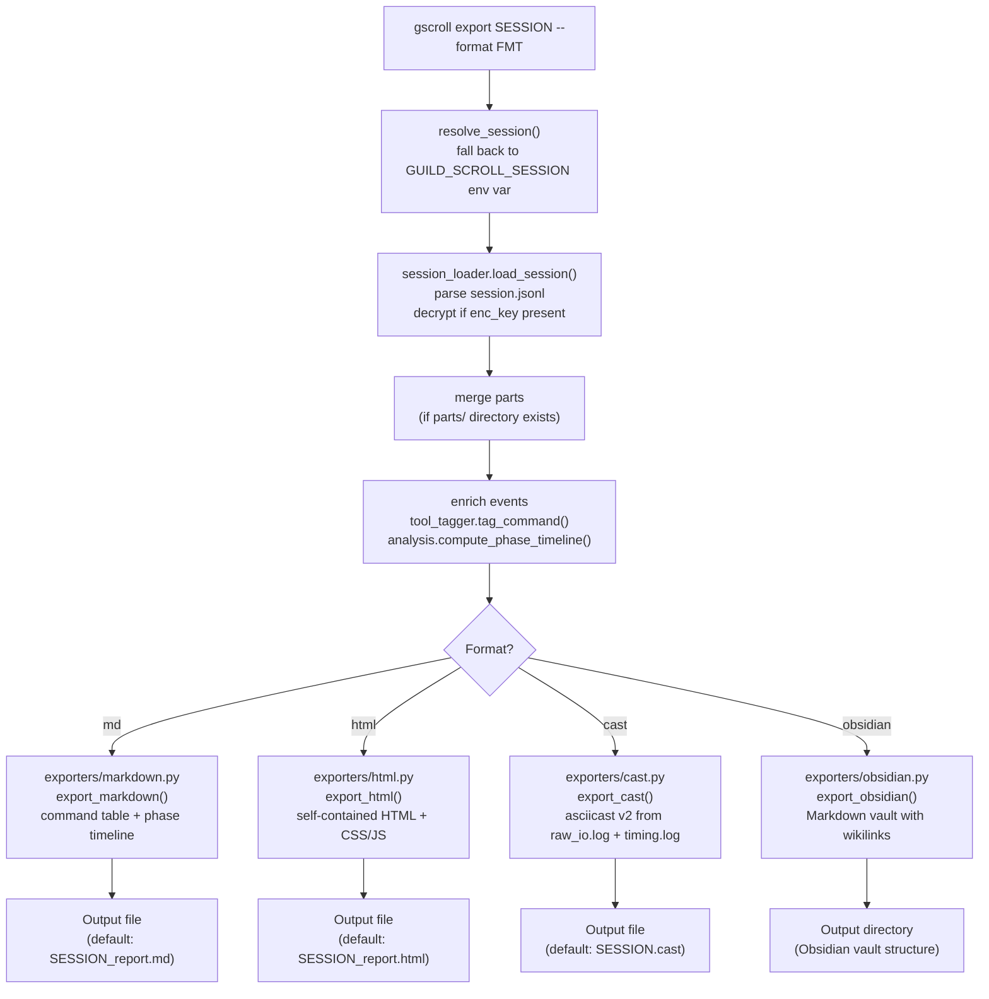
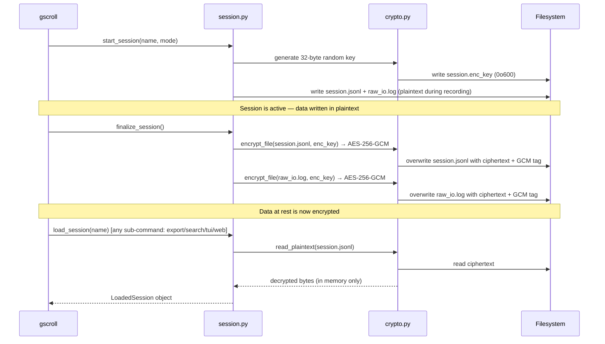
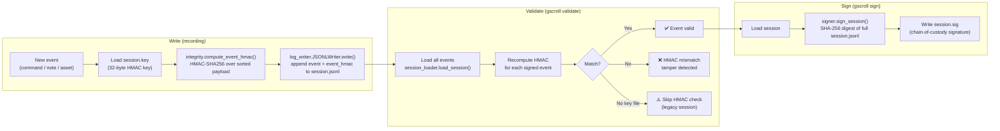
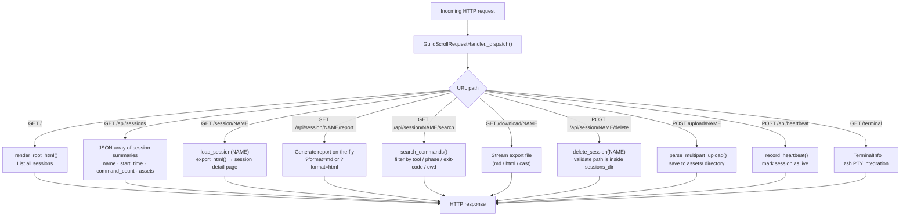
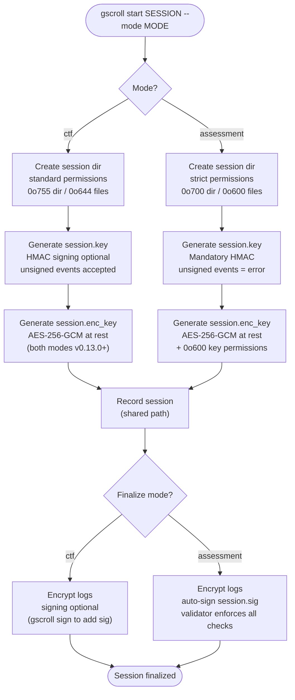

# Guild Scroll — Internal Process Diagrams

Visual walkthroughs of the key workflows inside Guild Scroll using Mermaid diagrams.

See also: [session-storage.md](session-storage.md) · [runtime-requirements.md](runtime-requirements.md) · [README](../../README.md)

---

## Export Pipeline

When `gscroll export` runs it loads the session once and then routes to a format-specific exporter. The diagram below shows every step from the CLI call to the final output file.

---

## Encryption Lifecycle

Every session gets a dedicated 256-bit AES key (`session.enc_key`) at creation time. Encryption is applied automatically on finalize and decryption is transparent whenever any `gscroll` sub-command reads log data.

---

## Session Integrity Chain

Guild Scroll uses HMAC-SHA256 to provide tamper-evidence for every event written to a session log. The integrity chain covers three phases: signing at write time, validation on demand, and chain-of-custody signing.

---

## Web Server Request Routing

`gscroll serve` starts a single-threaded HTTP server. Every request is dispatched by `GuildScrollRequestHandler._dispatch()` based on the URL path.

---

## CTF vs Assessment Mode Decision Tree

The `--mode` flag (or `GUILD_SCROLL_MODE` env var) selects the security policy applied from session start through finalization. The tree below highlights where the two paths diverge.

