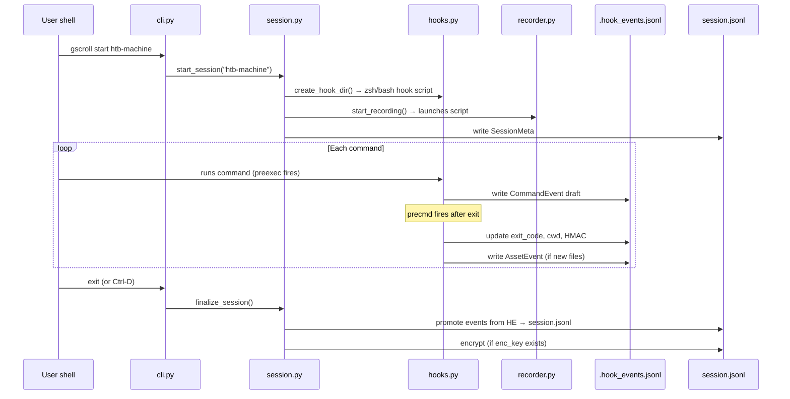
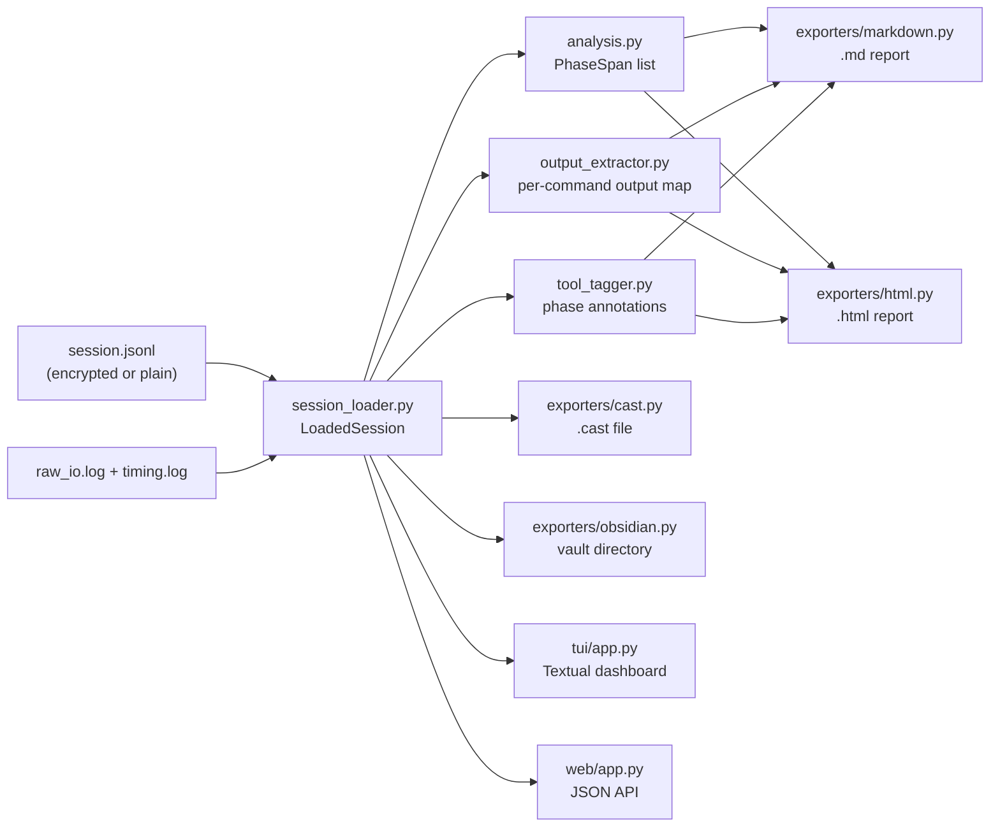

# Guild Scroll — Project Structure and Component Map

This document provides a complete outline of the Guild Scroll repository, a
module-by-module component guide, and annotated Mermaid diagrams intended to
support Figma wireframe work and more detailed diagram efforts.

---

## Directory Tree

```
Guild-Scroll/
├── src/guild_scroll/          # Main Python package
│   ├── __init__.py            # Package version
│   ├── __main__.py            # `python -m guild_scroll` entry point
│   ├── cli.py                 # Click CLI group — all user-facing commands
│   ├── config.py              # Centralized paths, constants, and env-var defaults
│   ├── session.py             # Session lifecycle: start, finalize, list, status, delete
│   ├── session_loader.py      # Load & parse JSONL events from disk; decrypt if needed
│   ├── recorder.py            # Launch the `script` process (raw I/O + timing logs)
│   ├── hooks.py               # Generate and inject zsh / bash shell hook scripts
│   ├── log_schema.py          # JSONL event dataclasses (SessionMeta, CommandEvent, …)
│   ├── log_writer.py          # Thread-safe JSONL writer with HMAC and file locking
│   ├── analysis.py            # Group commands into phase spans (recon / exploit / …)
│   ├── asset_detector.py      # Detect and copy newly-created files (downloads, clones)
│   ├── tool_tagger.py         # Map command names to security phases (100+ tools)
│   ├── search.py              # Filter commands by tool, phase, exit code, cwd, output
│   ├── crypto.py              # AES-256-GCM at-rest encryption and key management
│   ├── integrity.py           # HMAC-SHA256 key generation and event-level signing
│   ├── signer.py              # Create and write `.sig` signature files
│   ├── validator.py           # Validate structure, permissions, and HMAC integrity
│   ├── merge.py               # Merge multi-terminal session parts into one timeline
│   ├── replay.py              # Prepare timing + raw-I/O logs for `scriptreplay`
│   ├── screenshot.py          # Capture screenshots on X11 / Wayland
│   ├── sharing.py             # Pack / unpack `.tar.gz` session archives
│   ├── platform_detect.py     # Detect HTB / THM CTF platform from network interfaces
│   ├── updater.py             # Self-update: compare version, install via pip
│   ├── utils.py               # Shared helpers: timestamps, UUID, name sanitization
│   ├── web.py                 # Web-server launcher (TLS-capable)
│   ├── exporters/
│   │   ├── __init__.py
│   │   ├── markdown.py        # Markdown report generator
│   │   ├── html.py            # Self-contained HTML report
│   │   ├── cast.py            # Asciicast v2 (.cast) terminal replay file
│   │   ├── obsidian.py        # Obsidian vault structure with YAML frontmatter
│   │   └── output_extractor.py# Extract per-command output from raw_io.log
│   ├── tui/
│   │   ├── __init__.py
│   │   ├── app.py             # Textual TUI dashboard (optional dependency)
│   │   └── widgets.py         # Custom TUI widgets
│   └── web/
│       ├── __init__.py
│       └── app.py             # Flask/HTTP web application and JSON API
│
├── tests/                     # pytest suite (36 test files, ~300+ tests)
│   ├── conftest.py            # Shared fixtures (isolated_sessions_dir, CliRunner)
│   └── test_*.py              # One file per module or feature area
│
├── docs/
│   ├── context-engineering/   # Design notes and architecture references
│   │   ├── project-structure.md     # ← this file
│   │   ├── session-storage.md       # JSONL layout and path resolution
│   │   ├── runtime-requirements.md  # Environment prerequisites
│   │   ├── filesystem-context.md    # Agent/filesystem context patterns
│   │   ├── project-development.md   # Local development workflow
│   │   ├── tool-design.md           # Design philosophy for security tool support
│   │   └── references/              # Deep-dive implementation and pattern notes
│   ├── docker/                # Container deployment and persistence guides
│   └── security/              # Security review findings
│
├── scripts/
│   ├── check_markdown_links.py      # Validate relative links in all .md files
│   └── validate_copilot_customizations.py
│
├── .github/
│   ├── copilot-instructions.md      # Top-level Copilot workspace guidance
│   ├── instructions/                # Auto-loaded contributor rules
│   ├── agents/                      # Shared reviewer / maintainer personas
│   ├── skills/                      # Reusable slash-command workflows
│   └── workflows/                   # CI/CD pipeline definitions
│
├── docker/                    # Docker Compose and Dockerfile assets
├── k8s/                       # Kubernetes manifests (stub)
├── sessions/                  # Default session storage root
├── pyproject.toml             # Build metadata and entry point
├── CHANGELOG.md               # Version history
├── README.md                  # Primary user documentation
├── CLAUDE.md                  # AI-interaction quick reference
├── DOCKER.md                  # Container deployment reference
└── SECURITY.md                # Security disclosure policy
```

---

## Main Components and Their Relationships

### Recording Layer

- **`cli.py`** — Click entry point. All 18 sub-commands are wired here. Keeps
  imports lazy (inside each command body) to avoid circular imports and slow
  startup. Every command delegates immediately to a specialist module.

- **`session.py`** — Owns the session lifecycle. `start_session()` creates the
  directory tree, calls `hooks.py` to install shell hooks, generates a HMAC key
  via `integrity.py` and an encryption key via `crypto.py`, then hands off to
  `recorder.py`. `finalize_session()` reads the temporary `.hook_events.jsonl`
  written by hooks, promotes events into the main `session.jsonl`, optionally
  encrypts both log files, and (in assessment mode) auto-signs the session.

- **`recorder.py`** — Constructs and launches the OS-level `script` command
  that writes `raw_io.log` and `timing.log`. Handles both modern (`util-linux`
  ≥ 2.35) and legacy `script` flag sets.

- **`hooks.py`** — Generates a ZDOTDIR-based zsh hook script (or `BASH_ENV`
  bash script) that intercepts every command via `preexec` / `precmd`. Hooks
  write `CommandEvent` and `asset_hint` records to `.hook_events.jsonl` without
  modifying the user's own shell config.

### Data Model Layer

- **`log_schema.py`** — Defines all JSONL event dataclasses: `SessionMeta`,
  `CommandEvent`, `AssetEvent`, `NoteEvent`, `ScreenshotEvent`. Each implements
  `to_dict()` / `from_dict()` with the `type` key serialized first.

- **`log_writer.py`** — Thread-safe `JSONLWriter` with OS-level file locking
  (`fcntl` / `msvcrt`). Computes HMAC on each record when a key is present.
  Flushes to disk after every write.

- **`session_loader.py`** — Reads one or more `session.jsonl` files (including
  `parts/*/logs/session.jsonl` for multi-terminal sessions), decrypts
  transparently if an `enc_key` file exists, parses every line into the
  appropriate dataclass, sorts commands by `timestamp_start`, and returns a
  `LoadedSession` object consumed by all downstream features.

### Enrichment Layer

- **`tool_tagger.py`** — Stateless map of 100+ security-tool binary names to
  phases (`recon`, `exploit`, `post-exploit`). Used by exporters, search, and
  the web API to annotate commands.

- **`analysis.py`** — Groups consecutive same-phase commands into `PhaseSpan`
  objects. Feeds the phase-section layout used in Markdown and HTML exports.

- **`asset_detector.py`** — Snapshots the working directory before and after
  each command. Copies any newly-created files ≤ 50 MB into `assets/` and
  emits `AssetEvent` records.

- **`search.py`** — Implements `SearchFilter` with predicates for tool name,
  phase, exit code, working directory, and output content. Consumed by `cli.py`
  and `web/app.py`.

### Security & Integrity Layer

- **`crypto.py`** — AES-256-GCM encryption for `session.jsonl` and
  `raw_io.log`. The key lives in `session.enc_key` (permissions 0o600).
  Decryption is transparent; files without an `enc_key` are treated as
  plaintext.

- **`integrity.py`** — Generates the 256-bit HMAC session key stored in
  `session.key`. Computes per-event HMAC over key fields. Verification is used
  by `validator.py` and enforced unconditionally in assessment mode.

- **`signer.py`** — Creates a `.sig` file encoding operator identity,
  timestamp, and session HMAC. Used by the `gscroll sign` command.

- **`validator.py`** — Checks directory structure, JSONL format, HMAC
  integrity, and file permissions. Optional `--repair` mode can patch stale
  metadata fields without re-recording.

### Export Layer

All exporters receive a `LoadedSession` object and write to a caller-specified
output path.

- **`exporters/markdown.py`** — Produces phase-sectioned Markdown with command
  tables, captured output, notes, and an assets appendix.

- **`exporters/html.py`** — Produces self-contained HTML (inline CSS) with
  color-coded phase badges and collapsible command output.

- **`exporters/cast.py`** — Produces asciicast v2 `.cast` files by pairing
  `raw_io.log` chunks with `timing.log` offsets.

- **`exporters/obsidian.py`** — Produces an Obsidian-compatible vault directory
  with per-command markdown notes and YAML frontmatter.

- **`exporters/output_extractor.py`** — Parses `timing.log` delays to
  reconstruct the terminal output that followed each command in `raw_io.log`.

### User Interface Layer

- **`web.py` + `web/app.py`** — HTTP server and JSON API. Routes:
  `GET /api/sessions` (list), `GET /api/session/<name>` (load),
  `GET /api/search` (filter), `POST /api/note` (add annotation). Supports
  optional TLS 1.2+ via `--tls-cert` / `--tls-key`.

- **`tui/app.py` + `tui/widgets.py`** — Interactive Textual TUI dashboard.
  Optional dependency (`pip install 'guild-scroll[tui]'`). Displays a session
  timeline, phase breakdown, and command details.

- **`replay.py`** — Feeds `raw_io.log` and `timing.log` into `scriptreplay`
  at an adjustable playback speed.

### Supporting Services

- **`config.py`** — Single source of truth for directory names, file names,
  asset size limits, valid mode identifiers, and env-var defaults. Imported by
  virtually every other module.

- **`utils.py`** — ISO-8601 timestamp formatting, UUID generation, session-name
  sanitization. No external dependencies.

- **`platform_detect.py`** — Probes TUN/TAP interface addresses to detect
  HackTheBox (`10.10.*`) or TryHackMe (`10.x.*`) at session start.

- **`screenshot.py`** — Calls `gnome-screenshot` or `flameshot` when
  `DISPLAY` / `WAYLAND_DISPLAY` is present. Writes to `screenshots/`.

- **`merge.py`** — Reads all session parts from `parts/`, backs them up to
  `parts.backup/`, and writes a unified `session.jsonl` with renumbered
  sequence IDs.

- **`sharing.py`** — Creates a `.tar.gz` archive of the session directory for
  portability, and restores one via `gscroll import`.

- **`updater.py`** — Compares the running version with the latest GitHub
  release tag and performs a `pip install --upgrade` when a newer version is
  found.

---

## Component Relationship Diagrams

### High-Level Module Graph

```mermaid
graph TD
    CLI["cli.py\nClick entry point"] --> Session["session.py\nlifecycle"]
    CLI --> Loader["session_loader.py\nparse + decrypt"]
    CLI --> Exporters["exporters/\nmd · html · cast · obsidian"]
    CLI --> Search["search.py\nfilter commands"]
    CLI --> Validator["validator.py\nintegrity check"]
    CLI --> Merge["merge.py\nmulti-part join"]
    CLI --> Sharing["sharing.py\narchive pack/unpack"]
    CLI --> Web["web.py + web/app.py\nHTTP + JSON API"]
    CLI --> TUI["tui/\nTextual dashboard"]
    CLI --> Replay["replay.py\nscriptreplay"]
    CLI --> Updater["updater.py\nself-update"]
    CLI --> Signer["signer.py\ndigital signature"]

    Session --> Recorder["recorder.py\nlaunch script"]
    Session --> Hooks["hooks.py\nshell hook injection"]
    Session --> LogWriter["log_writer.py\nthread-safe JSONL"]
    Session --> Integrity["integrity.py\nHMAC key + signing"]
    Session --> Crypto["crypto.py\nAES-256-GCM"]
    Session --> AssetDetector["asset_detector.py\nfile capture"]
    Session --> PlatformDetect["platform_detect.py\nHTB / THM"]

    Loader --> LogSchema["log_schema.py\nevent dataclasses"]
    Loader --> Crypto

    Exporters --> Loader
    Exporters --> Analysis["analysis.py\nphase grouping"]
    Exporters --> ToolTagger["tool_tagger.py\nphase labels"]
    Exporters --> OutputExtractor["output_extractor.py\nraw I/O parsing"]

    Search --> ToolTagger
    Validator --> Integrity
    Web --> Loader
    Web --> Search
    Web --> LogWriter

    Analysis --> ToolTagger
    LogWriter --> Integrity

    Config["config.py\nconstants + paths"]
    Utils["utils.py\ntimestamps + sanitize"]
    Config -.->|imported by| Session
    Config -.->|imported by| Loader
    Config -.->|imported by| Exporters
    Config -.->|imported by| Web
    Utils -.->|imported by| Session
    Utils -.->|imported by| Sharing
```



### Session Recording Sequence



### Export and Analysis Flow



---

## Data Flow Summary

| Phase | Trigger | Key Modules | Output |
|-------|---------|-------------|--------|
| **Start** | `gscroll start` | `session.py`, `hooks.py`, `recorder.py`, `integrity.py`, `crypto.py` | `session.jsonl` (SessionMeta), shell hook script, HMAC key, enc key |
| **Record** | User types commands | Shell hooks → `log_writer.py` | `.hook_events.jsonl` entries per command |
| **Finalize** | `exit` / Ctrl-D | `session.py`, `asset_detector.py`, `log_writer.py`, `crypto.py` | Final `session.jsonl`, encrypted logs, optional `.sig` |
| **Load** | Any read command | `session_loader.py`, `crypto.py`, `log_schema.py` | `LoadedSession` in-memory object |
| **Enrich** | Export / Search | `tool_tagger.py`, `analysis.py`, `output_extractor.py` | Phase annotations, command output strings |
| **Export** | `gscroll export` | `exporters/markdown.py` etc. | `.md`, `.html`, `.cast`, or Obsidian vault |
| **View** | `gscroll serve` / `gscroll tui` | `web/app.py`, `tui/app.py` | Browser UI or terminal dashboard |
| **Validate** | `gscroll validate` | `validator.py`, `integrity.py` | Pass/fail report; optional repairs |

---

## Notes for Figma and Mermaid Diagram Work

The following outlines map well to visual layers in Figma or extended Mermaid
diagrams:

**Layer 1 — Shell Recording** (leftmost in a left-to-right flow)
- `hooks.py` intercepts commands; `recorder.py` captures raw I/O in parallel.
- The two outputs (`.hook_events.jsonl` and `raw_io.log` + `timing.log`) are
  independent streams that get merged at finalize time.

**Layer 2 — Persistence** (centre-left)
- `session.py` owns the directory tree; `log_writer.py` is the single write
  path for all JSONL events.
- `crypto.py` wraps the write path in assessment sessions.
- `integrity.py` attaches an HMAC to every event record.

**Layer 3 — Load & Enrich** (centre)
- `session_loader.py` is the gateway for all read operations.
- `tool_tagger.py` and `analysis.py` are stateless enrichment steps applied
  on load; they do not modify stored data.
- `output_extractor.py` bridges the raw binary log into text usable by
  exporters.

**Layer 4 — Output Surfaces** (rightmost)
- Four exporters produce file artifacts (`md`, `html`, `cast`, Obsidian).
- `web/app.py` serves the same data as a live JSON API.
- `tui/app.py` renders it interactively in the terminal.
- `replay.py` feeds the raw I/O directly to `scriptreplay`.

**Key Cross-Cutting Concerns** (shown as overlays or swimlanes)
- `config.py` — read by every layer; good candidate for a central "config bus"
  node in any diagram.
- `crypto.py` + `integrity.py` — security overlay from Layer 2 through Layer 3.
- `merge.py` — a special path that runs between Layer 2 and Layer 3 when
  multi-terminal sessions are joined.
- `platform_detect.py` + `screenshot.py` + `asset_detector.py` — side-channel
  enrichment that fires during Layer 1 (recording time).

---

## Related Documentation

- Session layout and JSONL event types: [session-storage.md](session-storage.md)
- Runtime prerequisites and env vars: [runtime-requirements.md](runtime-requirements.md)
- Design principles for security tool integration: [tool-design.md](tool-design.md)
- Local development workflow: [project-development.md](project-development.md)
- Deployment and persistence: [../docker/deployment-modes.md](../docker/deployment-modes.md)
