# Guild Scroll — Visual Diagrams Reference

This document collects every Mermaid diagram used across the project in one place, so that contributors and users can quickly understand how Guild Scroll is organised and how it works.

---

## Table of Contents

1. [Architecture Overview](#1-architecture-overview)
2. [Project Directory Structure](#2-project-directory-structure)
3. [CLI Command Overview](#3-cli-command-overview)
4. [Session Data Flow](#4-session-data-flow)
5. [Recording Lifecycle](#5-recording-lifecycle)
6. [Session Lifecycle State Machine](#6-session-lifecycle-state-machine)
7. [JSONL Data Model](#7-jsonl-data-model)
8. [Export Pipeline](#8-export-pipeline)
9. [Security and Integrity Model](#9-security-and-integrity-model)
10. [Module Dependency Map](#10-module-dependency-map)
11. [Multi-Session Flow](#11-multi-session-flow)

---

## 1. Architecture Overview

High-level picture of how the shell recorder, core processing layer, and user-facing surfaces fit together.

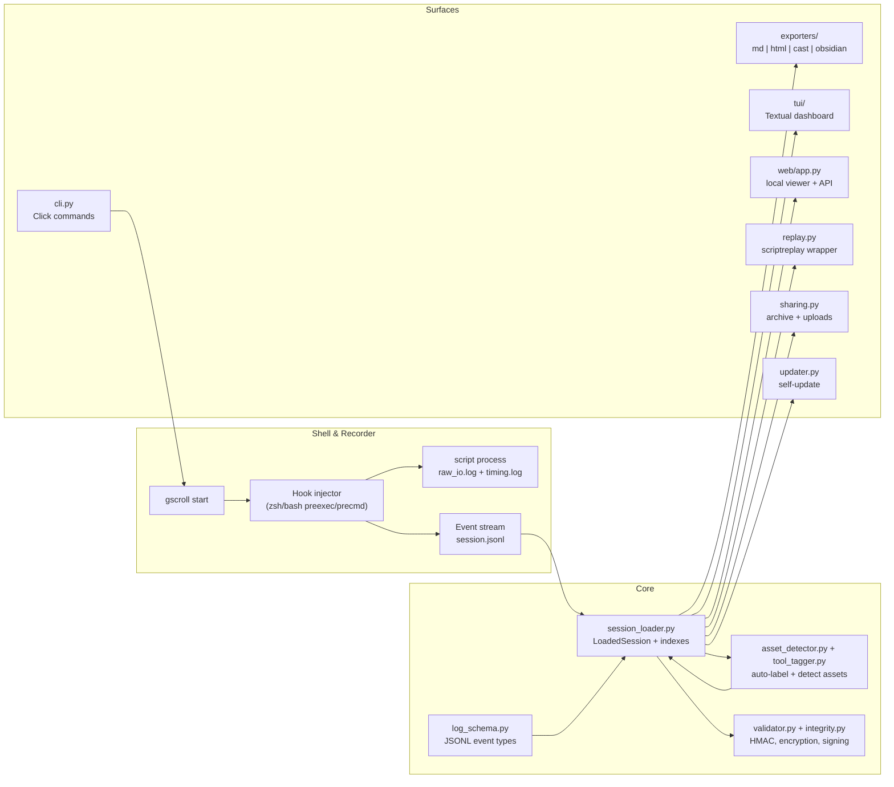

---

## 2. Project Directory Structure

Visual representation of the repository layout, highlighting how source code, tests, documentation, and infrastructure are organised.

```mermaid
graph TD
    root["Guild-Scroll/"] --> src["src/guild_scroll/\nMain Python package"]
    root --> tests["tests/\nPytest suite"]
    root --> docs["docs/\nDesign & deployment notes"]
    root --> github[".github/\nContributor guidance & skills"]
    root --> docker["docker/\nContainer definitions"]
    root --> k8s["k8s/\nKubernetes manifests"]
    root --> scripts["scripts/\nHelper scripts"]

    src --> cli_mod["cli.py\nClick entry-point"]
    src --> session_mod["session.py\nSession lifecycle"]
    src --> recorder_mod["recorder.py\nscript wrapper"]
    src --> hooks_mod["hooks.py\nShell hook injection"]
    src --> schema_mod["log_schema.py\nJSONL event types"]
    src --> writer_mod["log_writer.py\nEvent writers"]
    src --> enrich_mod["analysis.py / search.py\nasset_detector.py / tool_tagger.py"]
    src --> security_mod["validator.py / integrity.py\ncrypto.py / signer.py"]
    src --> exporters_mod["exporters/\nmd | html | cast | obsidian"]
    src --> tui_mod["tui/\nTextual dashboard"]
    src --> web_mod["web/app.py\nLocal viewer & API"]

    docs --> ctx["context-engineering/\nDesign decisions"]
    docs --> docker_docs["docker/\nDeployment guides"]
    docs --> sec_docs["security/\nSecurity reviews"]
    docs --> diag_docs["diagrams.md\nThis file"]

    github --> instructions[".github/instructions/\nPython, CLI, release rules"]
    github --> skills[".github/skills/\n/issue · /release · /doc-sync"]
    github --> agents[".github/agents/\nShared AI personas"]
```

---

## 3. CLI Command Overview

Every `gscroll` command and its key options at a glance.

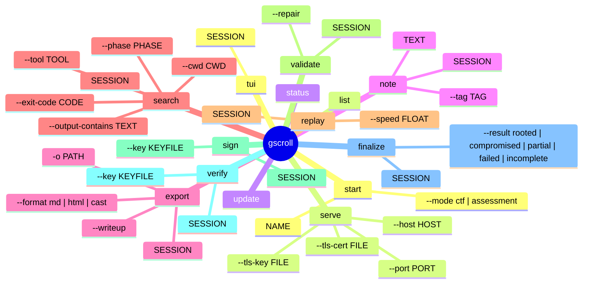

---

## 4. Session Data Flow

Step-by-step sequence of a full recording session, from `gscroll start` to `gscroll export`.

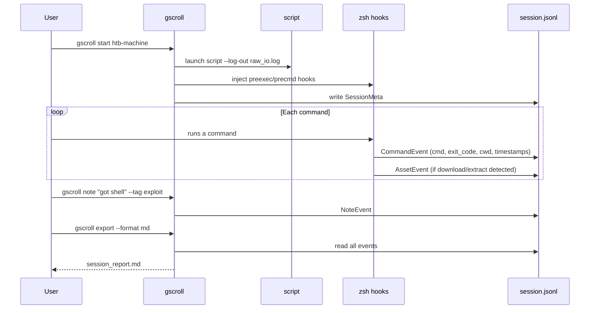

---

## 5. Recording Lifecycle

How a session progresses from start to shareable output.

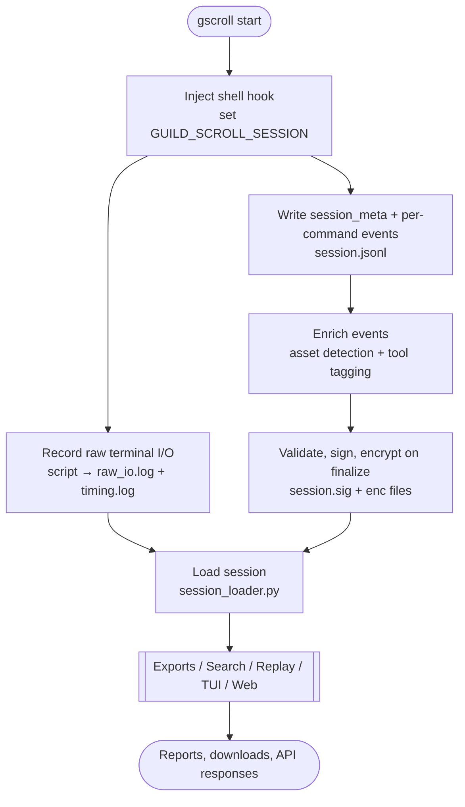

---

## 6. Session Lifecycle State Machine

The states a session passes through from creation to archival.

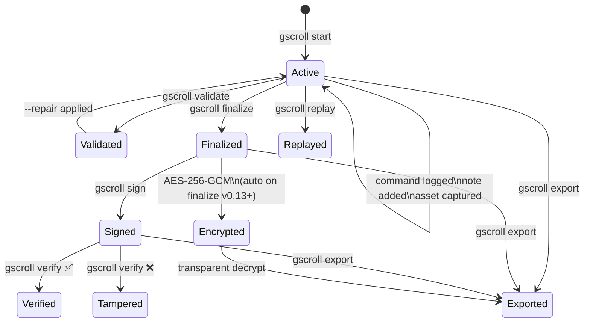

---

## 7. JSONL Data Model

The entity model for events written to `session.jsonl`.

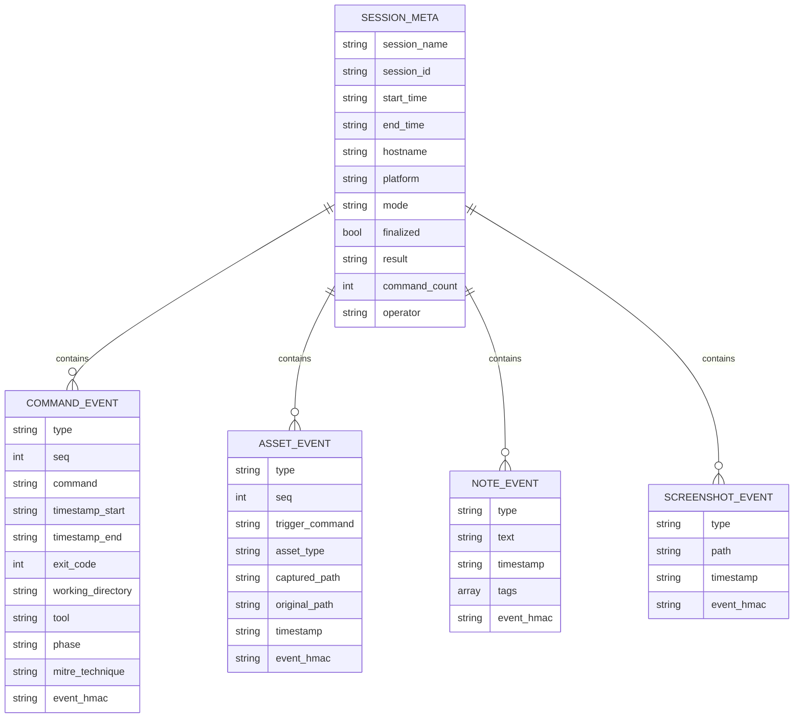

---

## 8. Export Pipeline

How a loaded session is transformed into each supported output format.

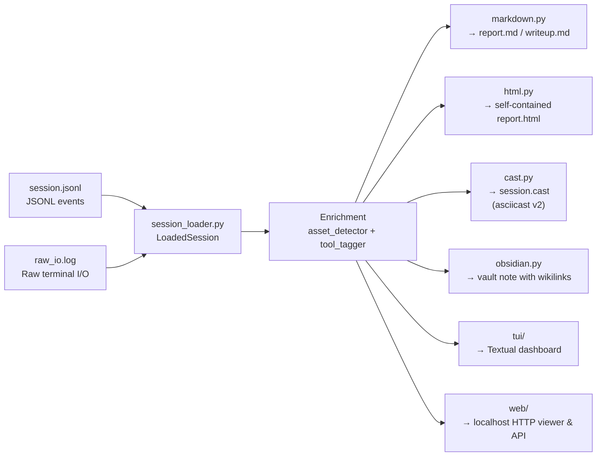

---

## 9. Security and Integrity Model

How HMAC signing and AES-256-GCM encryption protect session data.

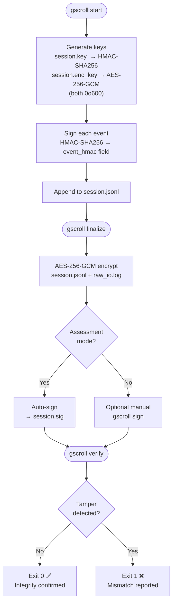

---

## 10. Module Dependency Map

How the Python modules inside `src/guild_scroll/` depend on each other.

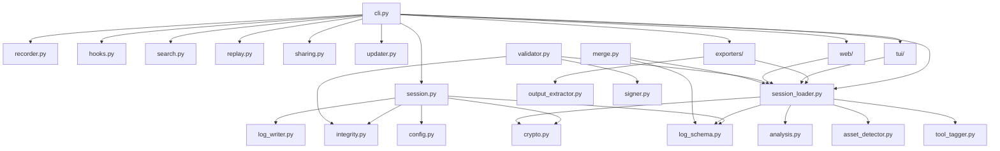

---

## 11. Multi-Session Flow *(M4)*

For scenarios with multiple concurrent terminals (e.g. attacker shell + reverse shell listener).

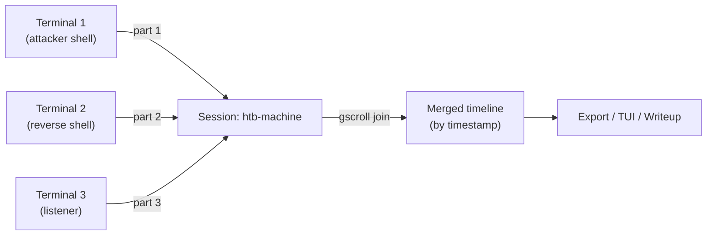

---

> **Keeping diagrams up to date:** whenever a new module, command, or workflow is added, update the relevant section above and the corresponding diagram in `README.md`. The CI link-checker (`scripts/check_markdown_links.py`) validates all relative links in this file on every push.
